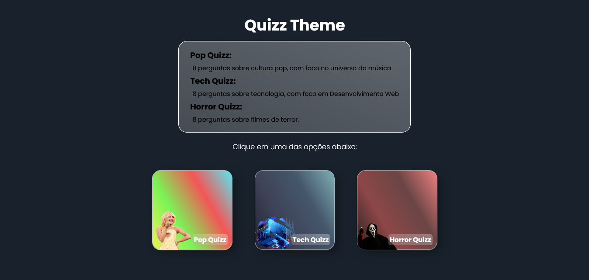
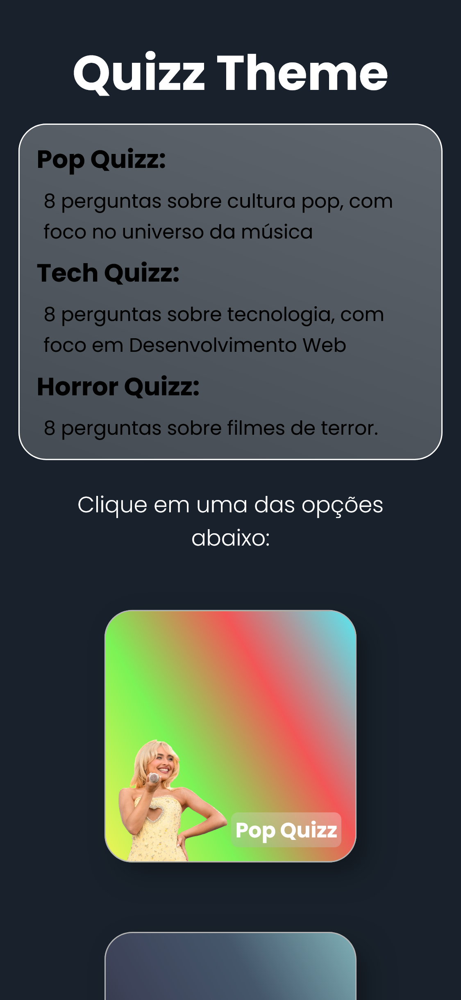

# Quizz App com React + Vite

Quizz Theme é um jogo com 3 quizzes de diferentes temas:

- Pop Quizz: Um Quizz de 8 perguntas sobre cultura pop;
- Tech Quizz: Um Quizz de 8 perguntas sobre desenvolvimento web;
- Horror Quizz: Um Quizz de 8 perguntas sobre filmes de terror;

Cada Quizz possui um background diferente e 4 alternativas que são automaticamente
corrigidas na hora da resposta.

A cada acerto, o usuario acumula 50 pontos;

É um projeto 100% responsivo, capaz de se adaptar a diferentes tamanhos de telas;
Este projeto foi feito utilizando React + Vite;

#React #JS #WebDevolopment #NodeJS #Quizz

## Conteúdo

- [Overview](#overview)
  - [Screenshot](#screenshot)
  - [Links](#links)
- [Sobre o projeto](#sobre-o-projeto)
  - [Feito com](#feito-com)
  - [O que aprendi](#o-que-aprendi)
  - [Desenvolvimento contínuo](#desenvolvimento-contínuo)
  - [Recursos Extras](#recursos-extras)
- [Autor](#autor)
- [Agradecimentos](#agradecimentos)

## Overview

### Screenshot

- **Desktop | width >= 1366px**



- **Smartphones | width: 375px**



### Links

- Projeto URL: [Repositório GitHub](https://github.com/CaioLopes5556/quizzes-app)
- Live Site: [Deploy do Projeto](https://caiolopes5556.github.io/quizzes-app)

## Sobre o projeto

### Feito com

- Semantic HTML5 markup
- CSS custom properties
- Flexbox
- React + Vite
- Javascript
- Node JS
- React Router

### O que aprendi

Aprendi a utilizar o React Router e definir diferentes rotas para o projeto:

- Home: página principal, onde os links para os quizzes estarão disponíveis
- Quizz: Componente que receberá os dados do quizz escolhido através de Props
  e estruturar toda a lógica do game
- NotFound: Caso o usuário acesse pela barra de endereço uma rota não definida,
  ele será redirecionada a esta página de erro

Também utilizei NavLinks para a navegação entre páginas.

Aperfeiçoei conhecimentos no em Hooks como useRef, que aqui foi utilizado para mo nitorar as alternativas, destacando a resposta correta após o usuario errar a questão.

Aprendi a criar o efeito "Glassmorphism" em algumas div's com CSS:

```
    background: var(--glassmorphism-gradient) ;
    -webkit-backdrop-filter: blur(10px);
    backdrop-filter: blur(10px);
```

é necessário que o linear-gradient definido para o efeito utilize RGBA para as cores
e deixa-las mais opacas com o ultimo valor:

```
     --glassmorphism-gradient: linear-gradient(
    200deg,
    rgba(255, 255, 255,0.3),
    rgba(172, 172, 172, 0.3)
  );
```

### Desenvolvimento Contínuo

Neste projeto utilizei um arquivo JS comum com os Arrays de Objetos dos Quizzes.
Logo, os dados não são manipulados como JSON e não me permitem persisti-los em um servidor.

Pretendo estudar mais sobre o JSON e requisições HTTP para criar novos projetos que utilizem uma API fake que simule uma aplicação real.

### Recursos Extras

- [Legacy](https://legacy.reactjs.org/docs/hooks-state.html)

- [greatStack - How To Make A Quiz App In React JS | Build Quiz App Using HTML, CSS and React JS](https://www.youtube.com/watch?v=VMZ7lcSdVnY&t=2386s)

Esse video do canal greatStack me ajudou a criar uma base de conhecimento para realizar este projeto.

Porém, neste projeto criei algumas adaptações como:

- o uso de React Router para criar outras rotas de navegação;
- uso de props para passar diferentes Arrays para o mesmo componente;
- personalização dos estilos: Criei um efeito 'Glasmorphism' para alguns containers no projeto e personalizei o visual de acordo com meus gostos.
- uso de alguns efeitos com CSS nos links da Home

## Autor

- Frontend Mentor - [@CaioLopes5556](https://www.frontendmentor.io/profile/CaioLopes5556)
- Linkedin - [@caio-silva-42848a236](https://www.linkedin.com/in/caio-silva-42848a236)

## Agradecimentos

Gostaria de agradecer a todos que curtiram meu ultimo projeto postado no Linkedin, é muito importante esse incentivo e me sinto muito grato por isso.
